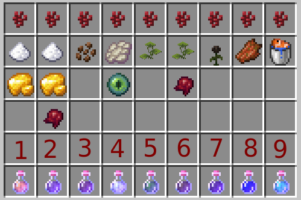

# Blaze Brew

This Minecraft datapack adds nine new unique and interesting potions, similar to the turtle master potion.

The blaze brewing datapack requires the nbt crafting mod:
- [Nbt crafting wiki](https://mcwiki.siphalor.de/nbt-crafting/v2/#home/) 
- [Nbt Crafting on Modrinth](https://modrinth.com/mod/nbt-crafting)
- [Nbt Crafting on Github](https://github.com/Siphalor/nbt-crafting/)

## New Potions
| - | Name | Ingredients | Effect | Time
--- | --- | --- | --- | --- |
| 1 | Spelunker Potion      | Sugar, Raw Gold                       | Haste II, Blindness       | 8:00 |
| 2 | Fatigue Potion        | Sugar, Raw Gold, Fermented Spider Eye | Mining Fatigue            | 4:00 |
| 3 | Coffee                | Cocoa Beans                           | Speed, Jump, Weakness     | 8:00 |
| 4 | Levitation Potion     | Phantom Membrane, Eye of Ender        | Levitation                | 0:10 |
| 5 | Potion Of Luck        | Small Drip Leaf                       | Luck                      | 5:00 |
| 6 | Rotten Luck Potion    | Small Drip Leaf, Fermented Spider Eye | Bad Luck                  | 5:00 |
| 7 | Wither Potion         | Wither Rose                           | Wither                    | 0:09 |
| 8 | Distilled Hunger      | Rotten Flesh                          | Hunger, Nausea            | 0:40 |
| 9 | Ena Potion            | Tropical Fish Bucket                  | Dolphin's Grace, Slowness | 3:00 |

# Potions Variants
| r | Name | Splash? | Lingering? | Strengthen? | Extend? | 
--- | --- | --- | --- | --- | --- |
| 1 | Spelunker Potion      | :heavy_check_mark: | :heavy_check_mark: | :x: | :x: |
| 2 | Fatigue Potion        | :heavy_check_mark: | :heavy_check_mark: | :x: | :x: |
| 3 | Coffee                | :x: | :x: | :heavy_check_mark: | :heavy_check_mark: |
| 4 | Levitation Potion     | :heavy_check_mark: | :heavy_check_mark: | :x: | :x: |
| 5 | Potion Of Luck        | :heavy_check_mark: | :heavy_check_mark: | :x: | :x: |
| 6 | Rotten Luck Potion    | :heavy_check_mark: | :heavy_check_mark: | :x: | :x: |
| 7 | Wither Potion         | :heavy_check_mark: | :heavy_check_mark: | :x: | :x: |
| 8 | Distilled Hunger      | :heavy_check_mark: | :heavy_check_mark: | :x: | :x: |
| 9 | Ena Potion            | :heavy_check_mark: | :heavy_check_mark: | :x: | :x: |